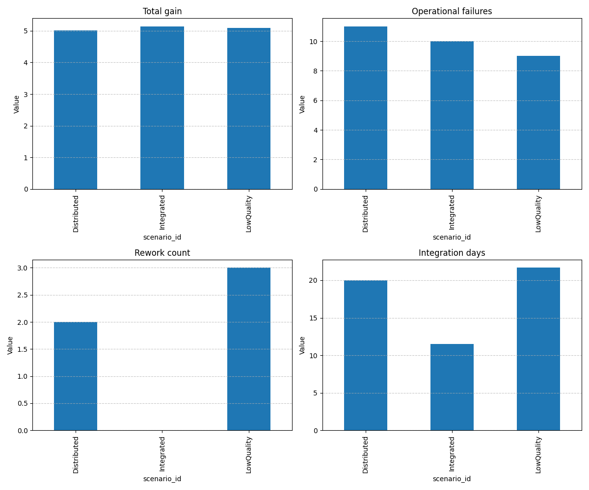

# Simulation Execution Report

## Scenario Comparison Summary

| total_experiments | technical_failures | operational_failures | total_gain | rework_count | integration_days | scenario_id |
| --- | --- | --- | --- | --- | --- | --- |
| 29 | 7 | 11 | 5.007724670350351 | 2 | 20.0 | Distributed |
| 29 | 9 | 10 | 5.138722741894642 | 0 | 11.494252873563218 | Integrated |
| 28 | 9 | 9 | 5.090066292443094 | 3 | 21.666666666666668 | LowQuality |

## Visualization

