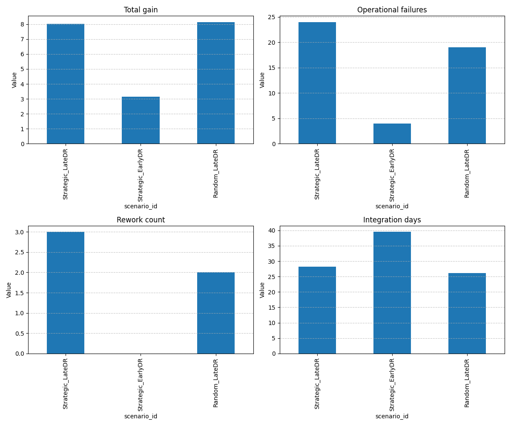

# Simulation Execution Report

## Scenario Comparison Summary

| total_experiments | technical_failures | operational_failures | total_gain | rework_count | integration_days | scenario_id |
| --- | --- | --- | --- | --- | --- | --- |
| 53 | 10 | 24 | 8.02110372311906 | 3 | 28.262987589603135 | Strategic_LateDR |
| 15 | 6 | 4 | 3.1409618966980304 | 0 | 39.53012701100657 | Strategic_EarlyDR |
| 52 | 18 | 19 | 8.143369620763217 | 2 | 26.18876793078928 | Random_LateDR |

## Visualization

