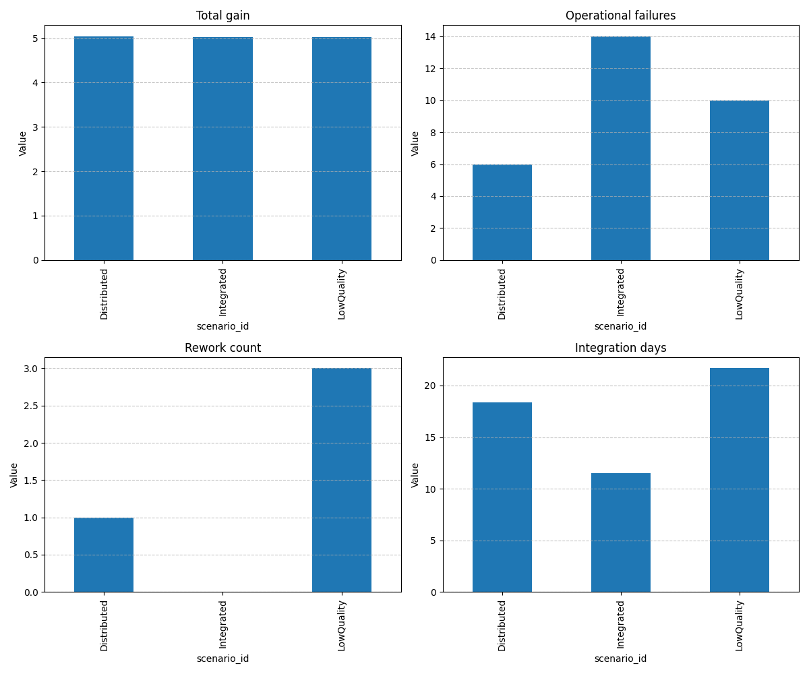

# Simulation Execution Report

## Scenario Comparison Summary

| total_experiments | technical_failures | operational_failures | total_gain | rework_count | integration_days | market_complaints | scenario_id |
| --- | --- | --- | --- | --- | --- | --- | --- |
| 29 | 17 | 6 | 5.03966832138626 | 1 | 18.333333333333336 | 15 | Distributed |
| 31 | 10 | 14 | 5.027532001668536 | 0 | 11.494252873563218 | 16 | Integrated |
| 33 | 8 | 10 | 5.020153175775699 | 3 | 21.666666666666668 | 8 | LowQuality |

## Visualization

