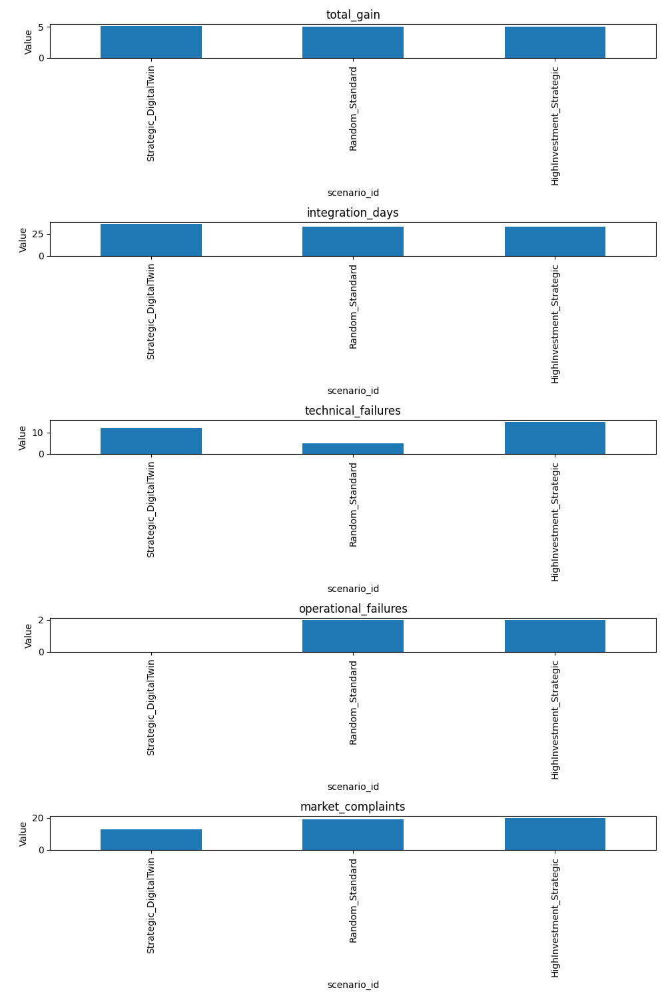

# Plan 5x: Integrated Simulation Report

## Scenario Comparison Summary

 total_experiments  technical_failures  operational_failures  total_gain  rework_count  integration_days  market_complaints              scenario_id
                25                  12                     0    5.184841             2         36.050531                 13    Strategic_DigitalTwin
                22                   5                     2    5.087913             0         33.040291                 19          Random_Standard
                24                  15                     2    5.066962             0         33.110127                 20 HighInvestment_Strategic

## Analysis Notes

- **Strategic vs Random**: Strategic selection focuses on high-uncertainty items, potentially reducing integration days and market complaints.
- **Digital Twin Effect**: Calibrating from logs reflects real-world team performance, showing a more realistic (and often tougher) baseline.
- **Market Feedback**: High residual uncertainty after DR leads to market complaints, highlighting the importance of the TRL gap.

## Visualization

