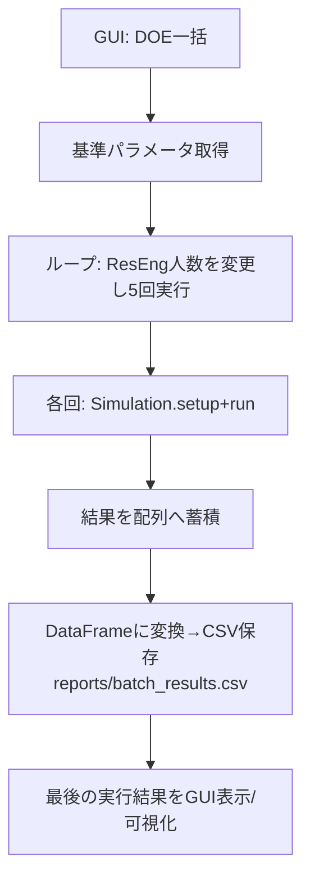
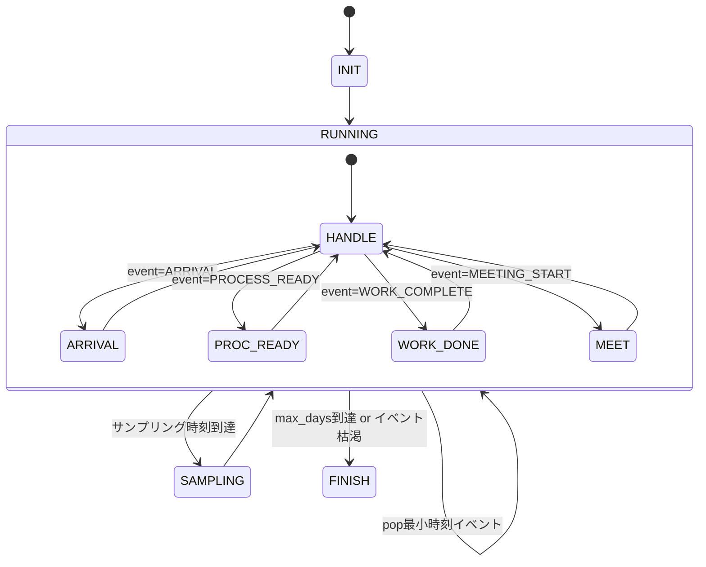

# Plan7 計算フローチャート（詳細）

本ドキュメントは、Plan7 における計算（シミュレーション）処理の全体像を日本語で整理したものです。GUI からの操作分岐、シミュレーション本体（DES: 離散事象シミュレーション）、メトリクス算出、可視化出力までの流れを詳細に示します。

---

## 1. 対象・前提
- 対象バージョン: 2026/DataAnalysis/Plan7（Plan7 現行）
- 主な関係モジュール:
  - `gui_sim.py`（GUI/エントリポイント）
  - `core/simulation.py`（シミュレーション本体：技術・チーム・ゲート構築と実行）
  - `core/engine.py`（DESエンジン：イベント駆動・WIPサンプリング）
  - `analysis/metrics.py`（メトリクス集計）
  - `core/scenario.py`（単シナリオの実行・可視化ユーティリティ）
- 代表的な入力:
  - GUIパラメータ（シナリオID、ステップ日数、戦略、リソース人数、WIP上限、DR会議周期・レビュア等）
  - 過去ログ（`configs/past_logs.csv`、Digital Twin補正を有効化時）
- 代表的な出力:
  - 可視化レポートPNG（`reports/viz/<scenario_id>_summary.png`, `_tech.png`, `_wip.png`）
  - バッチ結果CSV（`reports/batch_results.csv`）

---

## 2. 全体フロー（GUI → Simulation → Engine → Metrics → Viz）

```mermaid
flowchart LR
    A[GUI操作] --> B{実行種別}
    B -->|単体実行| C[start_simulation: 単体\n(run_simulation_thread)]
    B -->|3シナリオ比較| D[start_simulation: 比較\n(run_comparison_thread)]
    B -->|DOE一括| E[start_batch_simulation\n(run_batch_thread)]
    B -->|詳細レポート出力| X[output_viz_report]

    subgraph SIM[Simulation.setup_with_params]
      S1[技術要素の構築\nTechnologyItem[]] --> S2[チーム構築\nTeam{} + WIP上限]
      S2 --> S3[チーム間エッジ設定\n遅延/損失/歪み]
      S3 --> S4[ゲート構築\nWorkGate, MeetingGate 等]
      S4 --> S5[ReworkPolicy 設定]\n
    end

    C --> SIM
    D --> SIM
    E --> SIM

    subgraph ENG[SimulationEngine.run]
      E1[イベントキュー初期化/投入]\n --> E2[イベント反復: handle_event]
      E2 --> E3{event_type}
      E3 -->|ARRIVAL| E4[ノードへ投入/起動判定]
      E3 -->|PROCESS_READY| E5[ノード.process()]
      E3 -->|WORK_COMPLETE| E6[作業完了/次工程へ]
      E3 -->|MEETING_START| E7[会議処理/判定]
      E2 --> E8[WIPサンプリング\nresults.wip_history]
    end

    SIM --> ENG

    subgraph METRICS[analysis/metrics.calculate_metrics]
      M1[completed_jobs/nodes_stats/now\n/wip_history 受領]
      M2[リードタイム/差し戻し/\nDRゲート統計の集計]
      M3[WIP平均やCCDF生成]
    end

    ENG -->|完了後| METRICS --> VIZ[ScenarioManager.visualize_single\n(reports/viz/*.png)]
    X -->|直近結果から全シナリオ分| VIZ
```

ポイント:
- GUIは実行種別に応じてスレッドを起動し、進捗/部分結果を受け取りつつ描画を間引き更新。
- `Simulation.setup_with_params` で技術・チーム・ゲート（Work/DR）を構築、エンジンに登録。
- `SimulationEngine.run` はイベントキューを処理し、ARRIVAL/PROCESS_READY/WORK_COMPLETE/MEETING_START を捌く。
- 完了時に `analysis/metrics.calculate_metrics` でKPI・DR統計・WIPヒートマップ等を算出し、`ScenarioManager.visualize_single` でPNG出力。
- 「詳細レポート出力」は、直近の比較結果があれば全シナリオ分を自動検出して一括出力。

---

## 3. 単体実行フロー（run_simulation_thread）

```mermaid
flowchart TD
  A[GUI: Run 単体] --> B[パラメータ整形]
  B --> C[Simulation() 生成]
  C --> D[setup_with_params(params)]
  D --> E[engine.run(steps)]
  E --> F[部分進捗コールバック\n(kpis, tech_status, wip_history の一部)]
  E --> G[完了: KPIs/metrics 算出]
  G --> H[GUIへ最終結果表示]
  H --> I[output_viz_report で単体レポート出力可]
```

補足:
- ライブ更新のため、一定間隔で `gui_callback(at_time)` が呼ばれ、進捗率・CPU/Mem表示、部分グラフ更新が行われます。
- 完了時に `analysis/metrics.calculate_metrics` を呼び、`tech_history` と `wip_history` をメトリクスへ格納します。

---

## 4. 3シナリオ比較フロー（run_comparison_thread）

```mermaid
flowchart TD
  A[GUI: Run 比較(3本並行)] --> B[各シナリオでスレッド起動]
  B --> C1[Sim_A.setup+run]
  B --> C2[Sim_B.setup+run]
  B --> C3[Sim_C.setup+run]
  C1 --> D1[部分結果 comp_partial_result]
  C2 --> D2[部分結果 comp_partial_result]
  C3 --> D3[部分結果 comp_partial_result]
  D1 --> E[GUIで比較ダッシュボードを段階更新]
  D2 --> E
  D3 --> E
  C1 --> F1[完了: KPIs/metrics]
  C2 --> F2[完了: KPIs/metrics]
  C3 --> F3[完了: KPIs/metrics]
  F1 --> G[comparison_data へ格納]
  F2 --> G
  F3 --> G
  G --> H[output_viz_report で全シナリオ分PNG出力]
```

補足:
- 進捗は250ms以上の間引きでGUIに反映。WIP/技術のスナップショットも一部送られます。
- 完了時に `last_sim/last_params` も更新し、比較後でも詳細レポート出力が可能です。

---

## 5. DOE一括フロー（run_batch_thread）



---

## 6. DESイベントループ（SimulationEngine.run）



`handle_event` の要点:
- ARRIVAL: 対象ノードへジョブを投入し、即時処理可能なら `PROCESS_READY` をスケジュール。
- PROCESS_READY: ノードの `process(now)` を呼び出し、作業/会議の具体処理へ。
- WORK_COMPLETE: WorkGateの作業完了→次ノードへ `ARRIVAL` か完了へ集約。
- MEETING_START: MeetingGateの判定処理を実施。
- サンプリング: `sampling_interval` ごとに `results.wip_history` と GUI用コールバックを記録。

---

## 7. DR会議（Plan7MeetingGate）と判定ロジック

```mermaid
flowchart LR
  A[DR会議開始] --> B[キューから案件を上限数取り出し]
  B --> C[技術状態集計\n平均不確実性/成熟度]
  C --> D{閾値判定\nuncertainty<=Uth?\n& maturity>=Mth?}
  D -->|Yes| E[基準品質q]
  D -->|No| F[品質を0.5倍に低下]
  E --> G[乱数rand]
  F --> G
  G --> H{rand<q?}
  H -->|GO| I[next_nodeへARRIVAL]
  H -->|No| J{rand<q+(1-q)*r?}
  J -->|COND| K[rework_nodeへ\n差し戻し]
  J -->|NO_GO| L[nogo_node or reworkへ]
  I --> M[次会議を period_days 後に予約]
  K --> M
  L --> M
```

補足:
- `thresholds` で `uncertainty` と `maturity` の閾値を設定。未達の場合は通過確率を下げる。
- 判定結果（GO/CONDITIONAL/NO_GO）はメトリクスに集計され、DR通過率や待ち時間/意思決定遅延の分布に反映されます。

---

## 8. WorkGate（Plan7WorkGate）の処理

```mermaid
flowchart LR
  A[キューからジョブ取得] --> B[対象技術の選択\nphaseに応じた選好]
  B --> C[担当チーム決定]
  C --> D[前工程→現工程の伝達劣化を反映\n(ロス/歪み + tacitness依存)]
  D --> E[Experiment.run() 実行]
  E --> F[学習(agents.learn)]
  F --> G[KPI更新(件数/失敗種別/ゲイン)]
  G --> H[処理時間をサンプリングし\nWORK_COMPLETEをスケジュール]
```

---

## 9. メトリクス算出（analysis/metrics.py）

- 入力: `completed_jobs`, `nodes_stats`, `total_days(=engine.now)`, `wip_history`
- 主な出力項目:
  - 概要サマリ: スループット、リードタイム p50/p90/p95、差し戻し回数の平均/最大、平均WIP 等
  - DRゲート別統計: サイクルタイム・待ち時間・意思決定遅延、GO/COND/NO_GO比率
  - WIP: 総WIP平均、ノード別平均、時系列ヒストリー（ヒートマップ用）
  - CCDF: リードタイムの逆累積分布
  - Raw値: 各種リードタイムや差し戻し回数の生データ（可視化用）

---

## 10. 可視化・レポート出力

- `core/scenario.py: ScenarioManager.visualize_single(sim, metrics, scenario_id)` を使用。
- 生成物（例）:
  - `reports/viz/Scenario_A_summary.png`: 主要KPIとリードタイム/DR/WIPのハイレベルまとめ
  - `reports/viz/Scenario_A_tech.png`: 技術成熟/不確実性の推移
  - `reports/viz/Scenario_A_wip.png`: WIPヒートマップ
- GUIの「詳細レポート出力」は、直近の比較結果バッファから全シナリオ分を自動検出し、一括出力します。

---

## 11. 入出力と再現に必要な情報

- 入力（例）:
  - `scenario_id`, `steps`, `strategy`, `use_digital_twin`, `seed`
  - チーム/リソース: `res_n_servers`, `proto_n_servers`, `wip_limit_res` 等
  - DR設定: `dr1_period`, `dr2_period`, `cost_per_review`, `dr*_approvers`
  - 伝達ロス: `delay_*`, `loss_*`, `dist_*`
  - Rework方針: `rework_load_factor`, `max_rework_cycles`, `decay`
- 出力:
  - `reports/viz/*.png`, `reports/batch_results.csv`
  - GUIログ/比較ダッシュボード
- 再現の注意:
  - Digital Twin 補正有効化時は `configs/past_logs.csv` を参照。乱数シード `seed` で再現性を担保。

---

## 12. 例: 処理シーケンス（単体実行）

1) GUIでパラメータ入力 → 実行ボタン
2) `Simulation.setup_with_params(params)` が呼ばれ、技術・チーム・ゲート・Rework方針を構築
3) 初期イベント（ARRIVAL/MEETING予約）がエンジンに投入
4) `SimulationEngine.run(steps)` がイベントを時刻順に処理
5) サンプリング間隔毎に `wip_history` を記録し、GUIコールバックを呼び出し（任意）
6) 完了後 `calculate_metrics()` でメトリクス集計、GUIへ最終表示
7) 必要に応じて「詳細レポート出力」でPNG一式を生成

---

最終更新: 2026-03-25
