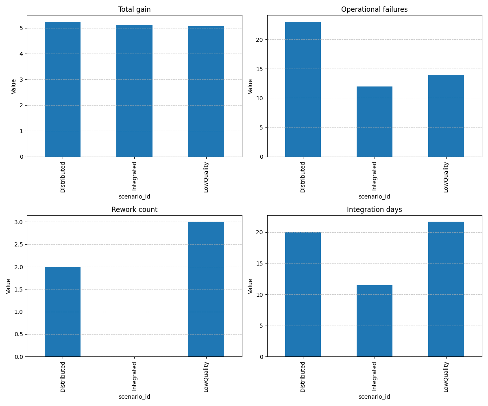

# Simulation Execution Report

## Scenario Comparison Summary

| total_experiments | technical_failures | operational_failures | total_gain | rework_count | integration_days | scenario_id |
| --- | --- | --- | --- | --- | --- | --- |
| 41 | 8 | 23 | 5.23137647768557 | 2 | 20.0 | Distributed |
| 35 | 13 | 12 | 5.1212810841872045 | 0 | 11.494252873563218 | Integrated |
| 34 | 16 | 14 | 5.069621385285831 | 3 | 21.666666666666668 | LowQuality |

## Visualization

