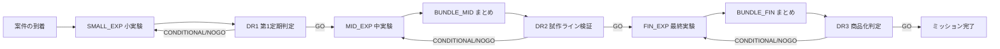

# DX4MGR Ver12 フロー図（DR3回構成）

```mermaid
flowchart LR
    A[案件の到着] --> B[SMALL_EXP 小実験]
    B --> C[DR1 第1定期判定]
    C -->|GO| D[MID_EXP 中実験]
    C -->|CONDITIONAL/NOGO| B

    D --> E[BUNDLE_MID まとめ]
    E --> F[DR2 試作ライン検証]
    F -->|GO| G[FIN_EXP 最終実験]
    F -->|CONDITIONAL/NOGO| D

    G --> H[BUNDLE_FIN まとめ]
    H --> I[DR3 商品化判定]
    I -->|GO| J[ミッション完了]
    I -->|CONDITIONAL/NOGO| G
```

多段DRでは差し戻し先が「直前の実験工程」になります。
