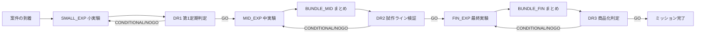

# DX4MGR Ver12 計算数式ガイド

## 1. フロー構成 (DR3回)

- 差し戻し先は「直前の実験工程」。
- BUNDLEは「一定件数がたまったら束ねる」処理です。

## 2. 離散イベントシミュレーションの仕組み
Ver12はイベント駆動型のシミュレーションです。
主なイベント:
- ARRIVAL: ジョブがゲートに到着
- PROCESS_READY: すぐ処理可能な場合に作業開始
- WORK_COMPLETE: 作業完了
- MEETING_START: DR会議のタイミング

## 3. 到着プロセス (Poisson)
到着間隔は指数分布に従います。

- 到着率: `arrival_rate` [件/日]
- 到着間隔: Δt ~ Exp(1 / arrival_rate)

例: arrival_rate=0.5 -> 平均2日に1件。

## 4. 作業時間 (WorkGate)
作業時間は指数分布 + 摩擦係数で伸びます。

- 基本時間: T_base ~ Exp(mean = duration)
- 摩擦係数: M_friction
- 実効時間: T_eff = T_base * M_friction

摩擦モデル:
- linear: M = 1 + friction_alpha * (n_servers - 1)
- pairs:  M = 1 + friction_alpha * n_servers * (n_servers - 1) / 2
- その他: M = 1

注意: n_serversを増やすと速くなる一方、摩擦で逆効果になる場合があります。
SMALL_EXPは n_servers=999 固定のため、摩擦を無視したい場合は friction_alpha を小さめにします。

## 5. バンドル処理 (BundleGate)
- キュー長が bundle_size に達すると処理が発火。
- bundle_size は定数 (分布ではなく固定値)。
- バンドル後は1つのJobとしてDRに進む。

## 6. DR会議の容量と品質 (MeetingGate)
### 6.1 容量
承認者の構成から実効容量を計算します。

- capacity = Σ(人数_i * capacity_i)

承認者タイプ:
- Senior: capacity=7, quality=0.76
- Coordinator: capacity=3, quality=0.70
- New: capacity=1, quality=0.40

### 6.2 品質 (GOの確率)
容量を重みとした加重平均で品質を算出します。

- quality = Σ(quality_i * capacity_i) / capacity

### 6.3 判定ロジック
乱数 u ~ Uniform(0,1)
- GO: u < quality
- CONDITIONAL: quality <= u < quality + (1 - quality) * conditional_prob_ratio
- NOGO: それ以外

判定後の遷移は decision_latency_days の遅延を持ちます。

## 7. 差し戻し (Rework) の数式
CONDITIONAL時のみ差し戻しを発生させます。

- rework_count を +1
- 重み: w = Beta(a, b) * decay^(rework_count - 1)
  - a = rework_beta_a
  - b = rework_beta_b
- 生成タスク数: n_new = ceil(rework_load_factor * w)

DR2だけは `dr2_rework_multiplier` が掛かります。

- DR2では: rework_load_factor * dr2_rework_multiplier

注意:
- rework_count > max_rework_cycles の場合、新規タスクは追加しません。
- 生成タスクは「計測用ログ」であり、追加ジョブとしては処理されません。

## 8. WIP計算
- 各時点の WIP = (キュー内 + 処理中) の合計
- sampling_interval 間隔でサンプルされます (既定は1日)

## 9. 主要指標の定義
- Completed count = 完了ジョブ数
- Throughput = Completed / days
- Lead time = 完了時刻 - 作成時刻
- P50/P90/P95 = リードタイム分位点
- Avg reworks = 平均差し戻し回数
- Avg WIP = WIPの平均

## 10. 品質ゲート判定 (Quality Gates)
- Gate1: 完了ジョブ数下限 (min_completed)
- Gate2: 95% CI幅 / 平均TP < max_ci_width
- Gate3: P90待ち時間 < max_wait_p90
- Gate4: 平均差し戻し回数 < max_reworks

PASSが揃えば overall PASS となります。
