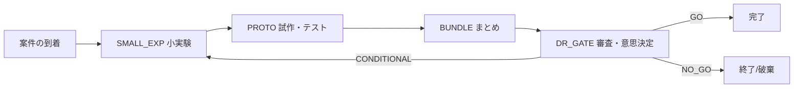
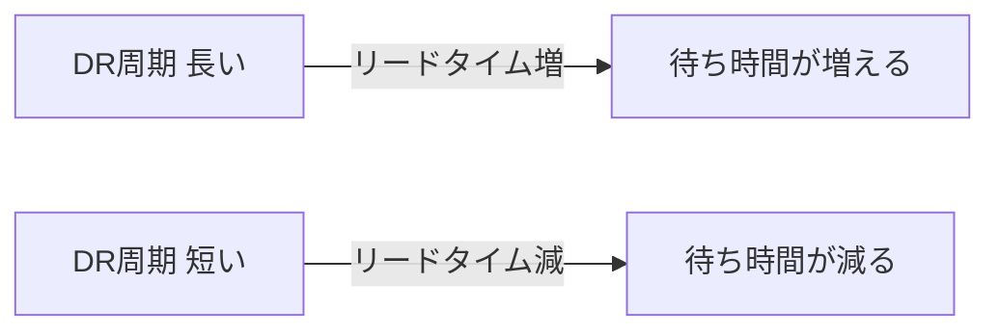
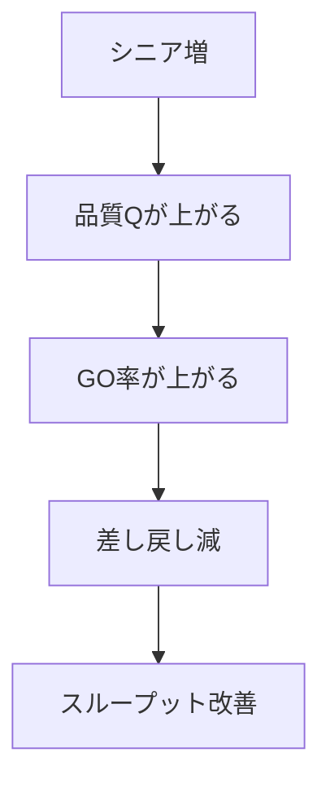
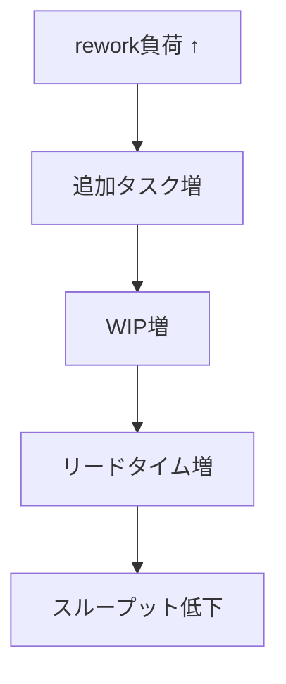
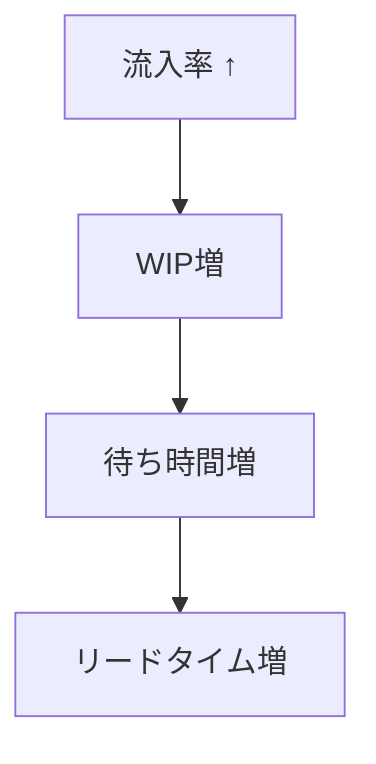

# DX4MGR Ver11 数式まとめ & パラメータ効果例（図付き）

このドキュメントは、DX4MGR Ver11 のシミュレーションで使われる主要な計算を**数式として整理**し、
パラメータ変更の効果を**図（概念図）付き**でわかりやすく説明します。
初心者向けに「式がどの挙動を表しているか」を丁寧に補足します。

---

## 1. 全体像（フロー図）

- **ポイント**: DR_GATE で「GO / 条件付き / NO_GO」の分岐が発生し、
  条件付きだと**差し戻し（再度小実験へ）**が起きます。
  - 多段DRの場合は**直前のDRゲートに戻る**（例: DR_GATE_3 → DR_GATE_2）。
    最初のDRのみ SMALL_EXP へ戻ります。

---

## 2. 数式としての定義まとめ

### 2.1 案件の流入（到着）

**到着間隔は指数分布**で生成されます。

\[
\Delta t \sim \text{Exponential}(\lambda), \quad \lambda = \text{arrival\_rate}
\]

- \(\lambda\) が大きいほど**案件が頻繁に来る**。
- これは「日々のばらつき」を再現するための典型的モデルです。

---

### 2.2 作業時間（小実験・試作）

**作業時間も指数分布**で決まります。

\[
T_{small} \sim \text{Exponential}(1/\mu_{small}), \quad \mu_{small} = \text{small\_exp\_duration}
\]
\[
T_{proto} \sim \text{Exponential}(1/\mu_{proto}), \quad \mu_{proto} = \text{proto\_duration}
\]

- 平均 \(\mu\) の作業時間があるが、
  実際には「短い仕事も長い仕事もある」という揺らぎを表します。

---

### 2.3 バンドル（まとめて審査）

バンドルは「一定数そろったらまとめる」というルールです。

\[
\text{bundle\_size} = k
\]

- \(k\) が大きいほど「まとめる効率」は上がるが、
  **待ち時間は増えやすい**。

---

### 2.4 審査キャパシティと品質（人員構成）

**審査キャパシティ**は人数と能力の合計で決まります。

\[
C = \sum_{i \in \text{approvers}} \text{capacity}_i
\]

**審査品質**は能力で重みづけした平均です。

\[
Q = \frac{\sum_{i} (\text{quality}_i \cdot \text{capacity}_i)}{\sum_{i} \text{capacity}_i}
\]

- **シニアが多いほど Q が上がる**。
- **人数が多いほど C が上がる**。

---

### 2.5 DR判定（GO / CONDITIONAL / NO_GO）

乱数 \(u \sim U(0,1)\) を使って分岐します。

\[
\begin{aligned}
\text{GO} &\quad \text{if } u < Q \\
\text{CONDITIONAL} &\quad \text{if } Q \le u < Q + (1-Q)\cdot r \\
\text{NO\_GO} &\quad \text{otherwise}
\end{aligned}
\]

- \(r = \text{conditional\_prob\_ratio}\) です。
- Q が高いほど「GO が増える」。

---

### 2.6 差し戻しの増殖ルール

**差し戻しの負荷重み**はベータ分布で決めます。

\[
W \sim \text{Beta}(a, b)
\]

これに**減衰係数**を掛けます。

\[
W_{cycle} = W \cdot \text{decay}^{(k-1)}
\]

**増殖タスク数**は次で決まります。

\[
N_{new} = \lceil \text{rework\_load\_factor} \cdot W_{cycle} \rceil
\]

- \(k\) は差し戻し回数。
- \(\text{rework\_load\_factor}\) が大きいほど「泥沼化」しやすい。

---

### 2.7 リードタイムとスループット

**リードタイム**:

\[
LT = t_{complete} - t_{create}
\]

**スループット**:

\[
TP = \frac{\#\text{completed}}{\text{total\_days}}
\]

---

### 2.8 WIP（仕掛かり）

**ある時点のWIP**は「待ち + 処理中」の合計です。

\[
WIP(t) = \sum_{node} (\text{queue}(t) + \text{in\_service}(t))
\]

**平均WIP**:

\[
\overline{WIP} = \frac{1}{T} \int_0^T WIP(t)\,dt
\]

---

## 3. パラメータ変更の効果例（図付き）

以下は「よく効くパラメータ」について、**概念図で効果を可視化**したものです。

### 3.1 DR周期（dr\_period）を短縮した場合

- **DRが頻繁になるほどリードタイムは短縮**されやすい。
- ただし運用コスト（会議頻度）は増える。

---

### 3.2 シニア比率を増やす（n\_senior ↑）

- 品質が上がると差し戻しが減り、
  **WIPの膨張を抑えられる**。

---

### 3.3 差し戻し負荷係数を増やす（rework\_load\_factor ↑）

- 「泥沼化」の再現。
- レジリエンスの低いプロセスを検出しやすい。

---

### 3.4 流入率を増やす（arrival\_rate ↑）

- **キャパシティが変わらない限り、混雑が悪化**する。

---

## 4. 強み・弱み（初心者向けに一言）

- **強み**: 人員構成・審査周期・差し戻しの影響を
  **数式で追えるため、経営判断に使いやすい**。
- **弱み**: コミュニケーションコストや学習効果は未反映。

---

## 5. 今後の拡張方向（例）

1. **学習効果**: 新人が時間とともに成長するモデル
2. **コミュニケーション負荷**: 人数増で調整コストが増える仕組み
3. **コストKPI**: スループット/人件費を比較できる指標

---

## 6. このドキュメントの使い方（初心者向け）

1. **式で「何が原因で変わるか」を理解する**
2. **図を見て「因果関係」を確認する**
3. 自分のケースに当てはめてパラメータをいじる

---

必要なら、次はこの内容を **実データのグラフ（実行結果）** に結びつけて
「どう読むか」を解説する資料も作れます。

Ver11では dr_periods で多段DRを指定できます。
